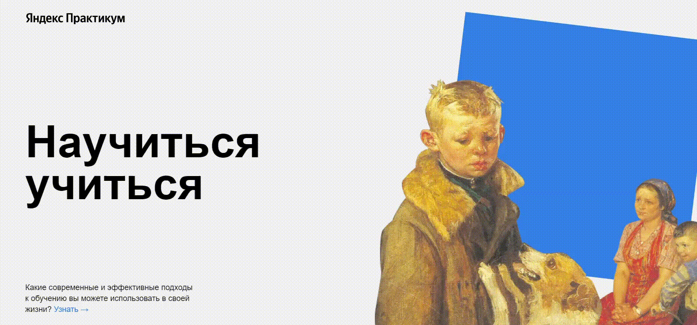

# Лэндинг "Научиться учиться"

## _Практическая работа в рамках курса по веб-разработке от Яндекс Практикум_

## **Описание**

### В работе над проектом были отработаны:

- синтаксис HTML, CSS
- флексбокс-верстка
- позиционирование элементов
- iframe
- анимации и трансформации средствами CSS
- организация файловой структуры по БЭМ (Nested)

**[Ссылка на проект]([https://nataliekalinkina.github.io/how-to-learn/])**
